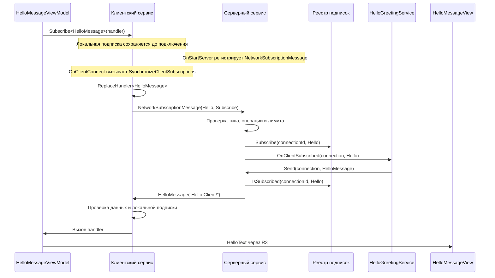

# NetworkMessages — сетевые сообщения с подписками

Unity-приложение для обмена сообщениями между сервером и клиентами через Mirror.
Сервер отправляет прикладное сообщение только тому подключению, которое подписалось на его тип.

Демонстрационный сценарий: клиент подключается, сообщает серверу о подписке на `HelloMessage`,
получает `Hello Client!` и показывает текст в интерфейсе и Unity Console.

Решение использует стандартные сообщения Mirror, Zenject для внедрения зависимостей и R3
для реактивного интерфейса. Прикладная логика находится в
[Assets/GameAssets/Scripts/NetworkMessages](Assets/GameAssets/Scripts/NetworkMessages).

## Содержание

- [Окружение и зависимости](#окружение-и-зависимости)
- [Быстрый запуск](#быстрый-запуск)
- [Настройка сцены и интерфейса](#настройка-сцены-и-интерфейса)
- [Управление сессией](#управление-сессией)
- [Архитектура и MVVM](#архитектура-и-mvvm)
- [Как проходит сообщение](#как-проходит-сообщение)
- [API сообщений](#api-сообщений)
- [Добавление нового типа](#добавление-нового-типа)
- [Диагностика и ограничения](#диагностика-и-ограничения)
- [Ручная проверка](#ручная-проверка)
- [Решение проблем](#решение-проблем)

## Окружение и зависимости

| Компонент | Использование в проекте |
| --- | --- |
| Unity | **2022.3.62f3**, версия закреплена в [ProjectVersion.txt](ProjectSettings/ProjectVersion.txt) |
| Mirror | Импортирован в `Assets/Mirror`; сетевые подключения и сериализация сообщений |
| KCP | Транспорт Mirror поверх UDP |
| Zenject | Находится в `Assets/Plugins/Zenject`; регистрация сервисов, создание UI и управление жизненным циклом |
| R3 | Ядро версии `1.3.0` указано в [Assets/packages.config](Assets/packages.config) |
| R3.Unity | Unity-адаптер подключён через Git URL с тегом `1.3.0` в [Packages/manifest.json](Packages/manifest.json) |
| TextMeshPro и Unity UI | Поля ввода, текст, кнопки, Canvas и ScrollRect |

Ядро R3 и Unity-адаптер — две части используемой конфигурации. Существующие зависимости
и настройки проекта уже подготовлены; для запуска демонстрации переустанавливать их не требуется.
Другие пакеты из manifest не означают, что модуль NetworkMessages использует их:
например, обмен сообщениями этого модуля не построен на MessagePipe.

Это открытое LAN-демо. Прикладная аутентификация, шифрование, поиск серверов,
подключение через relay и автоматическое переподключение в него не входят.

## Быстрый запуск

### Один экземпляр: проверка Host

1. Открой проект в Unity **2022.3.62f3**.
2. Открой [TestScene.unity](Assets/GameAssets/Scenes/TestScene.unity).
3. Дождись завершения импорта и компиляции.
4. Нажми Play.
5. Нажми **Start Host**.
6. Проверь появление `Hello Client!` в области сообщений и записей о подписке,
   отправке и получении в диагностическом логе.

Host одновременно запускает сервер и локальный клиент.
Поэтому приветствие появляется даже без второго приложения: его получает локальный клиент хоста.

### Два экземпляра на одном компьютере

1. Оставь один экземпляр в Unity Editor, второй запусти как собранное приложение.
2. В первом нажми **Start Host**.
3. Во втором введи `127.0.0.1` или `localhost` в поле адреса и заверши редактирование.
4. Нажми **Start Client**.
5. На клиенте должно появиться `Hello Client!`.
6. На хосте должны появиться записи о новом подключении, подписке и отправке сообщения.

Адрес применяется через событие `onEndEdit`: заверши ввод клавишей Enter,
кнопкой завершения на экранной клавиатуре или переводом фокуса.
В поле вводится адрес хоста, без `http://` и без `:7777`.
Порт берётся из настроек KCP.

### Два устройства в локальной сети

1. Подключи оба устройства к одной локальной сети.
2. На первом запусти приложение и нажми **Start Host**.
3. Узнай локальный IPv4-адрес первого устройства.
4. На втором введи этот адрес, заверши ввод и нажми **Start Client**.

Пример: если у компьютера-хоста адрес `192.168.1.25`, на клиенте нужно ввести
именно `192.168.1.25`.

На Windows адрес можно посмотреть командой:

```text
ipconfig
```

Найди IPv4-адрес активного Wi-Fi или Ethernet-адаптера, через который компьютер подключён
к нужной сети. Адрес виртуального адаптера или VPN может относиться к другой сети.
На мобильном устройстве IP обычно указан в сведениях о текущем Wi-Fi-подключении.

`localhost` и `127.0.0.1` всегда обозначают устройство, на котором запущен клиент.
На телефоне они не указывают на компьютер.

Если связь не устанавливается, проверь доступность UDP-порта хоста в брандмауэре
и отсутствие изоляции клиентов в Wi-Fi-сети. Устройства гостевой сети могут быть
изолированы друг от друга.

### Сборка для устройства

В текущем [EditorBuildSettings.asset](ProjectSettings/EditorBuildSettings.asset)
включена сцена `Assets/GameAssets/Scenes/TestScene.unity`.

Для ручной сборки открой **File → Build Settings**, выбери нужную платформу
и используй Build или Build And Run. Потребуется соответствующий модуль платформы
для Unity 2022.3.62f3.

UI создаётся из prefab во время выполнения и предназначен для работы в приложении,
а не только в Editor. Появление UI зависит от инициализации Zenject и заполненных ссылок,
описанных ниже.

## Настройка сцены и интерфейса

В репозитории уже есть сцена и prefab. Этот раздел описывает их устройство
и помогает восстановить настройку вручную.

### Сцена

В `TestScene` находятся `SceneContext` и `EventSystem`.
`SceneContext` запускает контейнер сцены и обеспечивает инициализацию `ProjectContext`.
`EventSystem` с подходящим модулем ввода нужен для работы кнопок и поля адреса.

Не создавай второй NetworkManager или второй экземпляр UI поверх тех, которые
создаются существующей конфигурацией.

### ProjectContext

[Assets/Resources/ProjectContext.prefab](Assets/Resources/ProjectContext.prefab)
содержит:

- `ProjectContext`;
- `NetworkMessagesInstaller`, включённый в список Mono Installers;
- `NetworkMessagesNetworkManager`;
- `KcpTransport`.

Installer находит NetworkManager и KcpTransport в иерархии своего контекста.
Поле `Transport` у NetworkManager должно ссылаться на тот же KcpTransport.

Текущая конфигурация:

| Настройка | Значение |
| --- | --- |
| KCP Port | `7777` / UDP |
| KCP DualMode | Включён |
| Network Address | `localhost` |
| Auto Create Player | Выключен |
| Player Prefab | Не назначен |
| Online / Offline Scene | Не заданы |
| Authenticator | Не назначен |
| Max Connections | `100` |

Для этого сценария не нужны игровой Player Prefab, NetworkIdentity на UI,
Commands или RPC: используются обычные сообщения Mirror.

Поле `_helloMessageViewPrefab` у installer ссылается на
[MessagesView.prefab](Assets/GameAssets/Prefabs/MessagesView.prefab).
Zenject создаёт его через `FromComponentInNewPrefab(...).AsSingle().NonLazy()`
и внедряет ViewModel.

### UI prefab

Canvas, расположение элементов, оформление, размеры и ссылки на компоненты
настраиваются вручную в prefab. Код не строит Canvas и не генерирует кнопки.

На компоненте `HelloMessageView` должны быть заполнены все поля:

| Поле | Компонент и назначение |
| --- | --- |
| `_startHostButton` | Button: запуск Host |
| `_stopHostButton` | Button: остановка Host |
| `_startClientButton` | Button: запуск Client |
| `_stopClientButton` | Button: остановка Client |
| `_networkAddressInput` | TMP_InputField: адрес сервера |
| `_helloTextLabel` | TextMeshProUGUI: история полученных приветствий |
| `_connectionLogLabel` | TextMeshProUGUI: диагностика |
| `_helloMessagesScrollRect` | ScrollRect области сообщений |
| `_connectionLogScrollRect` | ScrollRect области диагностики |

У каждого ScrollRect должны быть назначены собственные Content и Viewport.
Настрой layout так, чтобы высота Content увеличивалась вместе с текстом.

Для цветного диагностического лога включи Rich Text у `_connectionLogLabel`.
У текста приветствий View отключает Rich Text программно.
Обработка текстовых escape-последовательностей отключается у обоих текстовых компонентов.

Обработчики кнопок и поля адреса добавляются кодом. Дублировать эти вызовы
в Inspector → On Click / On End Edit не нужно.

## Управление сессией

`MirrorNetworkSessionService` определяет состояние по Mirror и публикует его
через R3. ViewModel передаёт команды сервису, View реагирует на свойства.

| Состояние | Start Host | Start Client | Stop Host | Stop Client | Адрес |
| --- | --- | --- | --- | --- | --- |
| Offline | Видна, доступна при свободном порте | Видна и доступна | Скрыта | Скрыта | Редактируется |
| Host | Скрыта | Видна, неинтерактивна | Видна | Скрыта | Заблокирован |
| Client | Видна, неинтерактивна | Скрыта | Скрыта | Видна | Заблокирован |

Состояние `Client` включает попытку подключения и установленное соединение.
Отдельного значения `Connecting` в enum нет; этап подключения виден в логе.
Пустой адрес отклоняется до запуска клиента.

**Stop Client** используется и для отмены незавершённого подключения.
**Stop Host** останавливает сервер и его локальный клиент.
После остановки или обнаруженного разрыва связи состояние возвращается в Offline.

### Проверка порта

В Offline сервис примерно раз в секунду пытается временно открыть UDP-сокет
с текущими `Port` и `DualMode` из KCP и сразу закрывает его.

Это проверка **локального** порта устройства, где выполняется приложение.
Она не проверяет наличие удалённого хоста, доступность его адреса или брандмауэр.
Хосты на разных устройствах могут использовать одинаковый номер порта.

При занятом порте Start Host становится неинтерактивной.
Когда порт освобождается, доступность обновляется при следующей проверке.
Причина недоступности или восстановления появляется в логе при изменении состояния.

Между предварительной проверкой и настоящим запуском порт может занять другой процесс.
Ошибка запуска обрабатывается отдельно: сервис очищает частично запущенную сессию
и повторно определяет доступность Host.

### Завершение приложения и переподключение

При штатном завершении приложение останавливает клиент, в том числе подключающийся,
и сервер через жизненный цикл Mirror. Сервис не завершает чужие процессы.

Принудительное завершение процесса не гарантирует выполнение `OnApplicationQuit`.
Удалённый клиент узнаёт об исчезновении хоста после обнаружения разрыва транспортом,
в том числе по таймауту. Отдельного сообщения «хост завершает работу» нет.

После закрытия приложения прежняя сессия хоста больше не существует.
Можно запустить новый Host на том же устройстве и порте, если порт доступен.
Клиенту потребуется снова нажать Start Client: автоматических попыток переподключения нет.
При новом подключении сохранённые локальные подписки отправляются серверу заново.

## Архитектура и MVVM

| Компонент | Ответственность |
| --- | --- |
| [NetworkMessagesInstaller](Assets/GameAssets/Scripts/NetworkMessages/Installers/NetworkMessagesInstaller.cs) | Регистрация зависимостей, типов сообщений и создание View |
| [NetworkMessagesNetworkManager](Assets/GameAssets/Scripts/NetworkMessages/Presentation/NetworkMessagesNetworkManager.cs) | Передача событий запуска, подключения, остановки и ошибок Mirror сервисам |
| [MirrorNetworkSessionService](Assets/GameAssets/Scripts/NetworkMessages/Services/MirrorNetworkSessionService.cs) | Запуск/остановка ролей, проверка порта, состояние сессии |
| [MirrorNetworkMessagesService](Assets/GameAssets/Scripts/NetworkMessages/Services/MirrorNetworkMessagesService.cs) | Типизированный API, обработчики Mirror, синхронизация подписок, проверка сообщений и лимиты |
| [ServerSubscriptionRegistry](Assets/GameAssets/Scripts/NetworkMessages/Services/ServerSubscriptionRegistry.cs) | Разрешённые типы и набор идентификаторов подписанных подключений для каждого типа |
| [HelloGreetingService](Assets/GameAssets/Scripts/NetworkMessages/Services/HelloGreetingService.cs) | Отправка приветствия после события подписки на Hello |
| [NetworkMessagesDiagnosticsService](Assets/GameAssets/Scripts/NetworkMessages/Services/NetworkMessagesDiagnosticsService.cs) | Безопасное форматирование диагностического текста, Unity Console и событие для UI |
| [HelloMessageViewModel](Assets/GameAssets/Scripts/NetworkMessages/Presentation/HelloMessageViewModel.cs) | Подписка на Hello, история сообщений и диагностики, команды сессии и реактивные свойства |
| [HelloMessageView](Assets/GameAssets/Scripts/NetworkMessages/Presentation/HelloMessageView.cs) | Сериализованные ссылки на UI, события элементов, отображение и прокрутка |

### Model

Отдельного класса `HelloMessageModel` нет.
Данные модели представлены контрактами сообщений, состоянием сессии и реестром подписок.
Прикладное поведение реализовано сервисами.

`HelloMessage` хранит текст и правило его допустимости.
`NetworkSubscriptionMessage` переносит тип сообщения и операцию Subscribe/Unsubscribe.
`NetworkSessionStateType` описывает роль приложения.

### ViewModel

`HelloMessageViewModel` получает сервисы через конструктор Zenject.
Она не создаёт NetworkManager, UI или сетевой транспорт.

ViewModel:

- оформляет локальную подписку на Hello при создании;
- хранит `HelloText`, `ConnectionLog` и `NetworkAddress` в реактивных свойствах;
- предоставляет `SessionState` и `IsHostStartAvailable` из сервиса сессии;
- передаёт команды Start/Stop и изменение адреса сервису;
- обновляет изменившиеся истории в `ILateTickable.LateTick()`;
- снимает подписки при `Dispose()`.

### View и R3

View подписывается на реактивные свойства и меняет текст, видимость кнопок
и их `interactable`. Сетевая логика во View отсутствует.

R3 здесь связывает состояние приложения с UI.
Сетевую доставку выполняет Mirror; создание объектов и вызовы Initialize/Tick/LateTick/Dispose
обеспечивает Zenject.

После изменения текста View запрашивает обработку layout через `ICanvasElement`.
В `LayoutComplete()` нужный ScrollRect прокручивается вниз.
`Canvas.ForceUpdateCanvases()` и корутины на каждое сообщение не используются.

### Контейнер

Сервисы и ViewModel зарегистрированы как `AsSingle()` в ProjectContext.
Клиентский, серверный и lifecycle-интерфейсы NetworkMessages указывают на один экземпляр сервиса.
В Host этот экземпляр обслуживает обе роли, сохраняя их состояние раздельно.

`HelloGreetingService` подписывается на серверное событие через `IInitializable`.
`MirrorNetworkSessionService` обновляет состояние через `ITickable`.
ViewModel объединяет изменения текста через `ILateTickable`.

## Как проходит сообщение



Регистрация обработчика на клиенте выполняется **до** отправки запроса подписки.
Поэтому ответ сервера уже имеет получателя на клиенте.

Повторный запрос Subscribe для существующей серверной подписки не вызывает
`OnClientSubscribed` второй раз и не создаёт дополнительное приветствие.
При этом входящий запрос учитывается ограничителем частоты.

После локальной отписки обработчик Mirror сохраняется до остановки клиента,
но больше не передаёт сообщения потребителю. Это позволяет игнорировать корректные сообщения,
которые сервер успел отправить до получения Unsubscribe.

При отключении сервер удаляет идентификатор подключения из всех подписок и очищает его лимиты.
При остановке сервера очищаются все подписчики; каталог зарегистрированных типов остаётся.

## API сообщений

Контракты определены в
[IClientNetworkMessagesService](Assets/GameAssets/Scripts/NetworkMessages/Services/IClientNetworkMessagesService.cs),
[IServerNetworkMessagesService](Assets/GameAssets/Scripts/NetworkMessages/Services/IServerNetworkMessagesService.cs)
и [ISubscribedNetworkMessage](Assets/GameAssets/Scripts/NetworkMessages/Contracts/ISubscribedNetworkMessage.cs).

### Регистрация

```csharp
service.Register<HelloMessage>(NetworkMessageType.Hello);
```

Регистрация выполняется в installer до запуска сессии и должна присутствовать на обеих сторонах.
Она связывает структуру сообщения с кодом `NetworkMessageType`.
Повторная регистрация кода или конфликт идентификатора Mirror приводят к исключению.
Обращение к незарегистрированному типу также считается ошибкой конфигурации.

### Подписка

```csharp
bool subscribed = clientMessages.Subscribe<HelloMessage>(HandleHelloMessage);
```

- До подключения сохраняется локальное намерение получать сообщения.
- После подключения устанавливается обработчик и отправляется запрос серверу.
- На один тип поддерживается **один локальный обработчик** в экземпляре сервиса.
- Повторный Subscribe возвращает `false` и не заменяет существующий обработчик.
- `true` означает принятие локальной подписки, а не подтверждение от сервера.
- В демонстрации Hello уже занят подпиской ViewModel; дополнительная подписка на тот же тип не добавляет второго слушателя.

### Отписка

```csharp
bool unsubscribed = clientMessages.Unsubscribe<HelloMessage>();
```

Возвращает `false`, если локальной подписки нет.
Существующая подписка удаляется локально, а подключённому серверу отправляется Unsubscribe.
После такой отписки автоматическое восстановление этого типа при следующем подключении не выполняется,
пока потребитель снова не вызовет Subscribe.

### Отправка

```csharp
HelloMessage message = new HelloMessage
{
    Text = "Hello Client!"
};

bool accepted = serverMessages.Send(connection, message);
```

`connection` — действующее серверное подключение `NetworkConnectionToClient`,
например переданное событием `OnClientSubscribed`.

Перед отправкой проверяются активность сервера, актуальность подключения,
признак Mirror `isAuthenticated`, данные сообщения, наличие подписки и лимит отправки.

`Send()` возвращает `false`, если проверка не пройдена. В этом случае сообщение
не ставится в очередь сервиса и автоматически не повторяется.
При `true` оно передано методу отправки Mirror; это не прикладное подтверждение получения.

`isAuthenticated` — стадия подключения Mirror. При отсутствии Authenticator в текущем проекте
она не означает проверку учётной записи пользователя.

Сервис отправляет сообщение конкретному подключению. Отдельного метода рассылки всем подписчикам нет.
Чтобы сохранить фильтрацию, прикладной код должен отправлять сообщения через этот API,
а не напрямую через `NetworkServer.SendToAll()` или `connection.Send()`.

## Добавление нового типа

Пример ниже показывает расширение API. `StatusMessage` в текущем проекте не добавлен.

### 1. Объявить контракт

Создай отдельный `StatusMessage.cs` в каталоге Contracts:

```csharp
using Mirror;

namespace Yuriy.MatchThree.NetworkMessages.Contracts
{
    public struct StatusMessage : NetworkMessage, ISubscribedNetworkMessage
    {
        private const int MAX_TEXT_LENGTH = 256;

        public string Text;

        public bool IsValid => !string.IsNullOrEmpty(Text) && Text.Length <= MAX_TEXT_LENGTH;

        public string Description => Text;
    }
}
```

Для установленного Mirror сохраняй прямое указание `NetworkMessage` в структуре:
его Weaver ищет реализации этого интерфейса при генерации сериализации.
`ISubscribedNetworkMessage` дополнительно предоставляет проверку данных и текст для диагностики.

Передаваемые данные размещаются в сериализуемых полях.
`IsValid` должен проверять ограничения конкретного сообщения.
`Description` используется только для лога; выбирай короткое описание.

### 2. Добавить код типа

В существующий `NetworkMessageType` добавь уникальное значение:

```csharp
public enum NetworkMessageType
{
    Hello = 0,
    Status = 1
}
```

Коды и структуры должны совпадать на сервере и клиентах.
Не меняй значения уже используемых кодов при добавлении нового типа.

### 3. Расширить существующую регистрацию

В `NetworkMessagesInstaller` замени существующую цепочку регистрации
`MirrorNetworkMessagesService` на:

```csharp
Container.BindInterfacesAndSelfTo<MirrorNetworkMessagesService>().AsSingle()
    .OnInstantiated<MirrorNetworkMessagesService>((context, service) =>
    {
        service.Register<HelloMessage>(NetworkMessageType.Hello);
        service.Register<StatusMessage>(NetworkMessageType.Status);
    });
```

Это изменение существующего binding, а не создание второго экземпляра сервиса.
Основной код сервиса и реестра подписок менять не требуется.

### 4. Подписаться и обработать сообщение

В потребителе, получившем `IClientNetworkMessagesService` через DI:

```csharp
_clientNetworkMessagesService.Subscribe<StatusMessage>(HandleStatusMessage);
```

Обработчик:

```csharp
private void HandleStatusMessage(StatusMessage message)
{
    UnityEngine.Debug.Log(message.Text);
}
```

При завершении работы потребителя:

```csharp
_clientNetworkMessagesService.Unsubscribe<StatusMessage>();
```

Серверный потребитель вызывает `Send(connection, statusMessage)` после подписки клиента.
Если сообщение нужно сразу при подписке, обработай `OnClientSubscribed`
и проверь `messageType == NetworkMessageType.Status`.
Существующий `HelloGreetingService` показывает этот подход для Hello.

## Диагностика и ограничения

### Две области вывода

| Область | Содержимое |
| --- | --- |
| Сообщения | Полученные приветствия с локальной датой, временем и направлением |
| Диагностика | Запуск, подключение, подписки, отправка, остановка, ошибки и доступность Host |

Пример записи в области сообщений:

```text
[11:01:59 29.09.2026] [Server -> Client] Hello Client!
```

Дата и время берутся с устройства-получателя. Сам текст диагностического UI
в текущей реализации не получает такую метку времени.

Цвета диагностики:

| Тип | Цвет |
| --- | --- |
| Success | Зелёный, `#55D66B` |
| Information | Светлый, `#C8D3E6` |
| Error | Красный, `#FF5C5C` |

В Unity Console сообщения сервиса имеют префикс `[NetworkMessages]`.
На устройстве они также идут в стандартный лог Unity; например, для Android можно использовать Logcat.

Примеры этапов, распределённых между логами сервера и клиента:

```text
[NetworkMessages] Client connected to server.
[NetworkMessages] Hello handler registered on client.
[NetworkMessages] Hello: Subscribe sent to server.
[NetworkMessages] Connection 1 subscribed to Hello.
[NetworkMessages] Server sent Hello to client connection 1: Hello Client!
[NetworkMessages] Client received Hello from server: Hello Client!
```

Идентификатор подключения и взаимный порядок записей в разных процессах могут отличаться.
Диагностический UI показывает события, переданные приложением в сервис диагностики,
а не копию всей Unity Console.

### Лимиты

| Ограничение | Поведение |
| --- | --- |
| HelloMessage | Непустой текст, максимум 1024 единицы `string.Length` |
| История сообщений | Последние 200 записей |
| История диагностики | Последние 200 записей |
| Обновление истории в UI | Один раз за LateTick, если были изменения |
| Диагностический текст | До 1200 символов обработки; при усечении добавляется многоточие |
| Подписки от клиента | Начальный запас `max(8, число зарегистрированных типов)`, восстановление 2 разрешений в секунду |
| Отправка сервера | Запас 8 сообщений на подключение, восстановление 2 разрешений в секунду |

Лимиты подписок и отправки независимы. Лимит отправки общий для всех прикладных типов
одного подключения.

Неизвестный тип, неизвестная операция подписки или превышение частоты входящих подписок
приводят к отключению нарушившего правила клиента.
Одинаковые повторные запросы тоже расходуют лимит подписок.

При превышении лимита отправки сервер возвращает `false`, не отправляет лишнее сообщение
и один раз за жизнь данного подключения сообщает об ограничении.
Обычная пачка корректных входящих сообщений сама по себе не отключает клиент.
Сообщение, не прошедшее `IsValid`, приводит к отключению клиента от такого сервера.

Разметка и управляющие символы обрабатываются перед показом диагностик.
Это защищает оформление лога, но не заменяет проверку данных сообщения.

История UI хранится в памяти. Старые записи вытесняются, а после закрытия приложения
история не восстанавливается. Собственного файлового архива и экспорта нет;
стандартное логирование Unity работает отдельно.

## Ручная проверка

Ниже — сценарии для ручной проверки поведения. Они не являются отчётом об уже выполненном
прогоне на конкретных устройствах.

| Действие | Ожидаемый результат |
| --- | --- |
| Запустить Host | Локальный клиент получает `Hello Client!` |
| Подключить второе приложение как Client | Новый клиент получает приветствие; хост видит подключение и подписку |
| Нажать Stop Client во время подключения к отсутствующему хосту | Попытка останавливается, интерфейс возвращается в Offline |
| Ввести пустой адрес и нажать Start Client | Сообщение об ошибке, клиентская сессия не запускается |
| Отключить и снова подключить клиент | Локальная подписка отправляется заново, приходит новое приветствие |
| Остановить Host и запустить снова | Старые серверные подписки очищены, новая сессия работает |
| Занять UDP-порт другим экземпляром | Start Host недоступна, в логе указана причина |
| Освободить порт | Start Host становится доступна примерно при следующей секундной проверке |
| Штатно закрыть Host | Клиент получает событие отключения |
| Принудительно завершить Host | Клиент обнаруживает потерю связи по механизму транспорта, возможно после таймаута |
| Накопить более 200 записей | Старые записи уходят из UI, новые прокручиваются вниз |

Для проверки фильтрации на уровне API используй управляемый потребитель без автоматической
Hello-подписки ViewModel либо отмени её через `Unsubscribe<HelloMessage>()`.
Дождись, пока сервер обработает отписку, и вызови `Send()` для этого подключения:
должен вернуться `false`, соединение должно сохраниться.
Отдельных кнопок подписки, отписки и произвольной отправки в текущем UI нет.

Передача серии сообщений для проверки лимита должна учитывать результат `Send()`:
неотправленное сообщение не является подтверждённо доставленным.
Повторную попытку, если она нужна прикладному сценарию, организует вызывающий код.

## Решение проблем

| Симптом | Что проверить |
| --- | --- |
| UI отсутствует в приложении | В сборку включена TestScene; SceneContext инициализируется; installer включён в ProjectContext; назначен MessagesView prefab |
| Кнопки не реагируют | EventSystem, модуль ввода, назначенные Button, перекрывающие элементы UI |
| Ошибка внедрения зависимостей | Наличие единственного нужного NetworkManager/KcpTransport в контексте, включение installer |
| Missing Script в ProjectContext или prefab | Исправность ссылок на компоненты и успешную компиляцию скриптов; это настройка Unity-объекта |
| Start Host недоступна | Причину в диагностике: активный Client/Host, занятый порт, неподходящий транспорт или IP-режим |
| «Обычно разрешается только одно использование адреса сокета» | Другой Host или процесс уже использует локальный UDP-порт |
| Клиент не подключается к другому устройству | LAN IP хоста, одинаковый KCP Port, доступ через брандмауэр, изоляцию Wi-Fi; не использовать localhost для удалённого хоста |
| Подключение есть, приветствия нет | Регистрацию Hello на обеих сторонах, локальную подписку ViewModel и запись серверной подписки в логе |
| Повторный Subscribe возвращает false | Тип уже имеет локальную подписку; второй обработчик автоматически не добавляется |
| Send возвращает false | Активность и актуальность подключения, подписку, валидность сообщения и лимит отправки |
| Видны теги color вместо цветов | Rich Text у диагностического TMP-компонента |
| Текст не прокручивается | Ссылки Content/Viewport и соответствующего ScrollRect, изменение высоты Content, активность View |
| Ошибки R3 | Наличие ядра R3 и R3.Unity, восстановление существующих зависимостей; не заменять реактивные свойства обходными UI-реализациями |

Для поиска владельца порта на Windows можно выполнить:

```text
netstat -ano -p udp
```

Найди строку локального порта, например `:7777`, и соответствующий PID.
Посмотреть имя процесса можно командой `tasklist /FI "PID eq 1234"`,
подставив найденный PID. Приложение не убивает процессы автоматически;
свой лишний экземпляр Host лучше остановить его кнопкой или закрыть штатно.

Состояние «порт свободен» означает только успешную локальную проверку сокета.
Если клиент всё равно не подключается, проверь адрес, сеть и доступность UDP отдельно.

